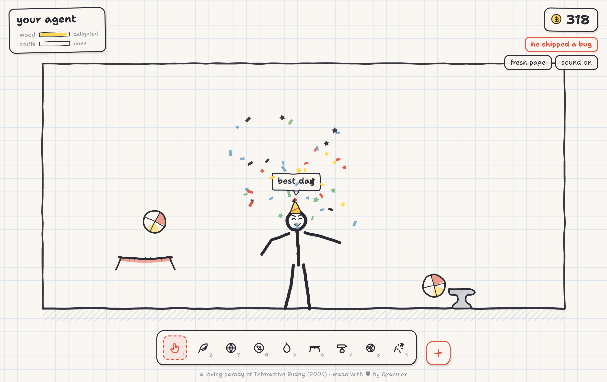

# Bonk Box

A stickman lives on a page of your sketchbook. Flick him around, drop cartoon
props on him, tickle him, feed him cookies. He takes it all in good humour, and
every scuff mends itself.

A loving parody homage to [Interactive Buddy](https://en.wikipedia.org/wiki/Interactive_Buddy)
(Newgrounds, 2005).



## Play it

Double-click `index.html`. That is the whole install.

No build step, no server, no npm. It runs straight from `file://` in any modern
browser. The only thing it fetches from the network is a Google font, and it
looks fine without one.

## How to play

Start with three toys and no coins.

- **Hand** (1) — hover near him for a nudge; click and drag any limb to pick him
  up and fling him. This is the whole toy, really.
- **Feather** (2) — hold it over him and he giggles. Kindness pays as well as
  slapstick does.
- **Beach ball** (3) — click to plop one in.

Everything he does earns doodle-coins. Spend them in the shop (the **+** button)
on more toys — water balloon, trampoline, anvil, gust fan, bowling ball,
confetti, gravity flip, piano — and on hats and ink colours. The hard hat is not
just a look: head bonks bounce off it with a *ting* and leave 78% fewer scuffs.

Other controls:

| Key | Does |
| --- | --- |
| `1`–`9`, `0` | Pick a tool from the tray |
| `R` | Fresh page (clears props, keeps your coins) |
| `M` | Mute |
| `Esc` | Close the shop |

Click his name tag to rename him. Coins, tools, hat, ink, name and mute all
persist in `localStorage`, and he says hello when you come back.

## What he does on his own

He balances actively: gentle muscle torques hold him upright, he breathes,
shifts his weight, and his eyes follow your cursor. Hit him hard enough and the
muscles switch off entirely — full ragdoll.

Once he settles he gets back up, and how he does it depends on how scuffed he
is. Barely marked, he kips up. Well scuffed, he pushes off the floor and climbs
to his feet in a wobble. Either way some of his limb strokes go smudged in the
fall, and they **redraw themselves tip-to-tail** as he rises, with a pencil
point riding the leading edge. That is the bit worth watching.

His mood drives his behaviour. Happy, he dances, waves and doodles hearts on the
floor. Grumpy, he sits down with his arms crossed and holds up small hand-written
protest signs. Cookies and confetti cheer him up and mend scuffs quickly; time
alone does it slowly.

## Layout

```
index.html            the page, classic <script> tags, no modules
css/style.css         the chrome: tray, shop, gauges, name tag
js/state.js           palette, tuning constants, save/load, economy
js/doodle.js          hand-drawn line primitives (wobble, ink, text, bubbles)
js/sound.js           WebAudio one-shots, synthesised, no audio files
js/particles.js       dust, confetti, splashes, eraser crumbs, coin tallies
js/buddy.js           ragdoll, muscles, poses, recovery  (no DOM — testable headless)
js/buddy-draw.js      drawing him: ink strokes, face, hats, the redraw signature
js/tools.js           tool catalogue, props, shop prices
js/ui.js              tray, shop, gauges, keyboard
js/main.js            canvas, room, input, collisions, render loop
vendor/matter.min.js  matter-js 0.20.0, vendored
test/physics-check.js headless feel-check (node test/physics-check.js)
```

## Checking the physics

The ragdoll is the product, so it has a test:

```bash
node test/physics-check.js
```

It steps the real `js/buddy.js` headless and asserts the things that decide
whether he feels right: does he stand unaided, do the joints stay together
through a hard fling, does energy run away, does the muscle blend ever snap,
does he survive twelve hard bonks in a row, and is a step cheap enough for
60fps. All sixteen checks should pass.

## Credits

Built as a homage. Interactive Buddy was made by Shock Value in 2005 — if you
have not played the original, play the original.

Physics by [matter-js](https://brm.io/matter-js/). Everything drawn at runtime
on a canvas; there are no image assets in this repository.
