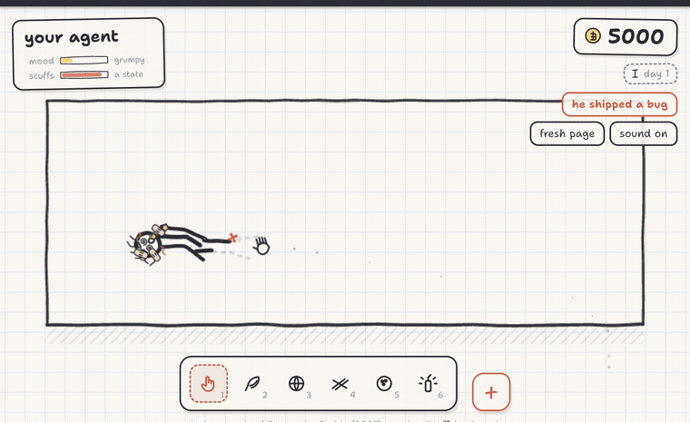

# Bonk Box

**Your agent. In a box. Bonk him.**

A tiny physics toy where a stickman lives on a page of your sketchbook. Flick
him about, launch fireworks at him, knock over the fort he built. He always
bounces back.

## Tell your agent to install it

> install bonk-box from github.com/eddiesanjuan/bonk-box

That is the whole thing. Your agent reads [`install.sh`](install.sh), drops the
app in `/Applications` and opens it. The joke writes itself: your agent installs
the toy you bonk it with.

Or, if you would rather do it yourself:

```bash
curl -fsSL https://raw.githubusercontent.com/eddiesanjuan/bonk-box/main/install.sh | bash
```

**Or just play it in a browser:** [bonk-box-production.up.railway.app](https://bonk-box-production.up.railway.app)



[](https://github.com/eddiesanjuan/bonk-box/stargazers)
[](LICENSE)
[](index.html)
[](index.html)

A loving parody homage to [Interactive Buddy](https://en.wikipedia.org/wiki/Interactive_Buddy)
(Newgrounds, 2005).


## Play it

Three ways, same toy:

- **On the web:** [bonk-box-production.up.railway.app](https://bonk-box-production.up.railway.app)
- **On your Mac:** a small always-on-top desktop app — see below
- **From this folder:** double-click `index.html`. That is the whole install.

Your coins, toys and streak live in your browser (or in the app), on your own
machine. Nothing is uploaded anywhere. The web version and the desktop app each
keep their own separate save.

No build step, no server, no npm. It runs straight from `file://` in any modern
browser. The only thing it fetches from the network is a Google font, and it
looks fine without one.

## How to play

Start with three toys and no coins.

- **Hand** (1) — hover near him for a nudge; click and drag any limb to pick him
  up and fling him. This is the whole toy, really.
- **Feather** (2) — hold it over him and he giggles. Kindness pays as well as
  slapstick does.
- **Beach ball** (3) — press, drag back and release to sling it. Every
  throwable works this way, with a dotted arc showing where it will land.

Everything he does earns doodle-coins. Spend them in the shop (the **+** button)
on more toys — water balloon, trampoline, bundle of sticks, anvil, gust fan,
party popper, bowling ball, confetti, gravity flip, firework, piano — and on
hats and ink colours. The hard hat is not just a look: head bonks bounce off it
with a *ting* and leave 78% fewer scuffs.

Come back tomorrow and he hands you a little sack of coins — the buddy you
spend all day bonking pays your allowance. Keep coming back and the streak
unlocks things coins cannot buy: a paper crown at three days, a bubble wand at
a week, gold ink at a fortnight, and at thirty days a little sun that rises in
his room for him to lie under.

At the far end of the shop are four legendaries, priced to be a proper haul.
The golden anvil rains some of your coins back out when it lands. The star
shower fills the room with weather. The bottle rocket takes him for a lap. And
the most expensive thing in the game is a tiny friend who follows him about,
helps with the fort and high-fives him — you grind bonk-coins to buy him a
friend, which is the joke at the top of the ladder.

Buy the **bundle of sticks** and leave them lying about. When he is cheerful and
nothing else is going on, he will walk over, carry them back one at a time and
build himself a little fort, then draw a flag on it. Knock it down and see what
happens.

Other controls:

| Key | Does |
| --- | --- |
| `1`–`9`, `0` | Pick a tool from the tray |
| `R` | Fresh page (clears props, keeps your coins) |
| `M` | Mute |
| `Esc` | Close the shop |

Click his name tag to rename him. Coins, tools, hat, ink, name and mute all
persist in `localStorage`, and he says hello when you come back.

## What he does on his own

He balances actively: gentle muscle torques hold him upright, he breathes,
shifts his weight, and his eyes follow your cursor. Hit him hard enough and the
muscles switch off entirely — full ragdoll.

Once he settles he gets back up, and how he does it depends on how scuffed he
is. Barely marked, he kips up. Well scuffed, he pushes off the floor and climbs
to his feet in a wobble. Either way some of his limb strokes go smudged in the
fall, and they **redraw themselves tip-to-tail** as he rises, with a pencil
point riding the leading edge. That is the bit worth watching.

His mood drives his behaviour. Happy, he dances, waves and doodles hearts on the
floor. Grumpy, he sits down with his arms crossed and holds up small hand-written
protest signs. Cookies and confetti cheer him up and mend scuffs quickly; time
alone does it slowly.

## Layout

```
index.html            the page, classic <script> tags, no modules
css/style.css         the chrome: tray, shop, gauges, name tag
js/state.js           palette, tuning constants, save/load, economy
js/doodle.js          hand-drawn line primitives (wobble, ink, text, bubbles)
js/sound.js           WebAudio one-shots, synthesised, no audio files
js/particles.js       dust, confetti, splashes, eraser crumbs, coin tallies
js/buddy.js           ragdoll, muscles, poses, recovery  (no DOM — testable headless)
js/buddy-draw.js      drawing him: ink strokes, face, hats, the redraw signature
js/tools.js           tool catalogue, props, shop prices
js/fort.js            the fort: gathering, stacking, pride, and the sulk
js/companions.js      the rocket ride, the tiny friend, the daily gift, the sun
js/ui.js              tray, shop, gauges, keyboard
js/main.js            canvas, room, input, collisions, render loop
vendor/matter.min.js  matter-js 0.20.0, vendored
server.js             tiny zero-dependency static server, for hosting
install.sh            macOS installer
desktop/              Tauri v2 wrapper for the desktop app
test/physics-check.js headless feel-check (node test/physics-check.js)
```

## Checking the physics

The ragdoll is the product, so it has a test:

```bash
node test/physics-check.js
```

It steps the real `js/buddy.js` headless and asserts the things that decide
whether he feels right: does he stand unaided, do the joints stay together
through a hard fling, does energy run away, does the muscle blend ever snap,
does he survive twelve hard bonks in a row, and is a step cheap enough for
60fps. All sixteen checks should pass.

## Desktop app

A small window that floats above everything else, so he can potter about in the
corner of your screen while you work.

```bash
./install.sh
```

That drops **Bonk Box** in `/Applications` and opens it. Once it is running:

- **Option+Command+B** hides and summons him
- the menu-bar stickman has **Show / Hide** and **Quit**
- to uninstall, quit it and drag `Bonk Box` from `/Applications` to the Trash

To rebuild it from source after changing the toy:

```bash
cd desktop
npm install          # first time only
npm run build        # copies the web toy in, then compiles
```

`desktop/build-frontend.sh` copies `index.html`, `css/`, `js/` and `vendor/`
into `desktop/dist/`. The page at the repo root stays the single source of
truth — nothing under `desktop/dist/` is edited by hand.

The published build is **arm64 (Apple silicon)**. On an Intel Mac `install.sh`
falls back to building from source, which needs Rust and Node.

## For AI agents: installing Bonk Box

If someone asks you to install Bonk Box on their Mac, run this:

```bash
curl -fsSL https://raw.githubusercontent.com/eddiesanjuan/bonk-box/main/install.sh | bash
```

Or, if you already have the repo cloned, `./install.sh` from inside it.

What it does: downloads the latest release, unpacks it to
`/Applications/Bonk Box.app`, clears the download quarantine flag (the build is
unsigned — it was compiled on a laptop, not signed by an Apple developer
account, so Gatekeeper would otherwise refuse to open it), and opens the app.
If there is no usable release asset for their machine it builds from source
instead, and tells you exactly what is missing if Rust or Node are not there.

What they get: a small always-on-top window with a stickman in it. He balances,
breathes, and watches the cursor. Drag him around by any limb and he ragdolls,
bounces off the walls and picks himself back up. Everything pays doodle-coins,
which buy more toys from the shop.

Tell them: **Option+Command+B** hides and summons the window, the menu-bar
stickman has Show / Hide and Quit, and uninstalling is dragging
`Bonk Box` from `/Applications` to the Trash.

The repository is `github.com/eddiesanjuan/bonk-box`.

## Credits

Built as a homage. Interactive Buddy was made by Shock Value in 2005 — if you
have not played the original, play the original.

Physics by [matter-js](https://brm.io/matter-js/). Everything drawn at runtime
on a canvas; there are no image assets in this repository.

## Star tracker

[](https://star-history.com/#eddiesanjuan/bonk-box&Date)
